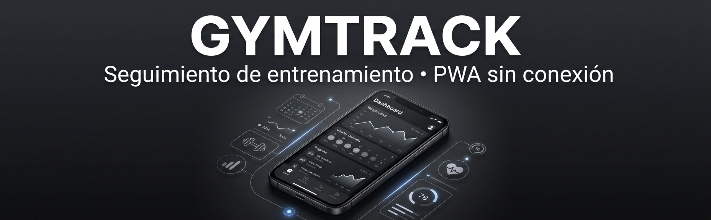

App web progresiva (PWA) 100% cliente para registrar tus entrenamientos en tu dispositivo móvil.
Tus datos se guardan solo en tu dispositivo (localStorage). Sin servidores, sin cuentas, sin internet obligatorio.

## ✨ FUNCIONES
| Función                         | Descripción                                                                         |
| ------------------------------- | ----------------------------------------------------------------------------------- |
| 📋 **Rutinas**                  | Crea plantillas de ejercicios con series objetivo y empieza un entreno con un toque |
| 📝 **Registro de entrenos**     | Ejercicios con series, repeticiones y peso (o tiempo/distancia para cardio)         |
| ⏱️ **Temporizador de descanso** | Anillo de progreso entre series con aviso sonoro                                    |
| 📚 **Biblioteca de ejercicios** | Organizada por grupo muscular; crea los tuyos (fuerza o cardio)                     |
| 📅 **Calendario**               | Vista mensual con días de entrenamiento; toca un día para ver el detalle            |
| ⚖️ **Medidas corporales**       | Peso y medidas personalizadas con gráfica y registros por fecha                     |
| 🕓 **Historial**                | Sesiones pasadas con detalle completo                                               |
| ⚙️ **Ajustes**                  | Unidades (kg/lb, km/mi), nombre y descanso por defecto                              |
| 💾 **Copia de seguridad**       | Exportar/importar en JSON                                                           |
| 📲 **PWA offline**              | Funciona sin conexión (service worker) e instalable como app nativa                 |

## 📲 ¿CÓMO SE INSTALA EN EL DISPOSITIVO?

La PWA necesita servirse por **HTTPS** para instalarse. La forma más rápida (y gratuita):

1. Ve a **netlify.com/drop
2. Arrastra la carpeta `gymtracker`
3. Abre la URL en Safari (iPhone)
4. Toca **Compartir → “Añadir a la pantalla de inicio”** → nombre `GymTrack`

> Si ya tenías una versión anterior desplegada en la misma URL, tus datos se conservan automáticamente.

## 🔒 PRIVACIDAD - *NO COMPARTIMOS TUS DATOS*

Todo vive en el **almacenamiento local** del navegador/PWA de tu dispositivo.

- Borrar la app de la pantalla de inicio elimina sus datos.
- Recomendado: usa **“Exportar datos”** de vez en cuando para guardar una copia en iCloud/Ficheros.

## 🏗️ ESTRUCTURA DEL PROYECTO

gymtracker/
├── index.html            # Punto de entrada
├── styles.css            # Estilos globales
├── app.js                # Lógica principal
├── sw.js                 # Service worker (offline)
├── manifest.webmanifest  # Configuración PWA
├── icons/                # Iconos de la app
└── README.md

## 🛠️ STACK DE HERRAMIENTAS Y TECNOLOGÍAS EMPLEADAS

  

  Hecho para uso personal · Sin servidores · Sin tracking · Solo tú y tus datos

